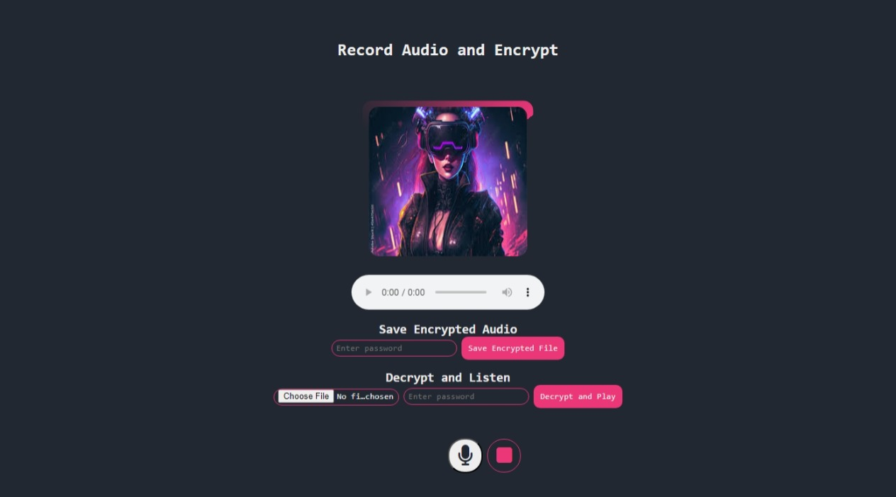

Here's an attractive and professional README for your audio recording and encryption project:

---

# 🎙️ Audio Recorder with Encryption 🔐

## Overview
This web application allows users to **record audio**, **encrypt** it using a password, and **save** it securely. It also enables users to **decrypt** and listen to their encrypted audio files later. The app provides an intuitive user interface with modern design and utilizes **Wavesurfer.js** to visualize the audio recordings.

## Key Features
- 🎤 **Record Audio**: Capture high-quality audio using your device's microphone.
- 🔒 **Encrypt Audio**: Securely encrypt recorded audio with a user-defined password.
- 🛡️ **Password Protection**: Ensure that only users with the correct password can decrypt and listen to the audio.
- 📂 **File Save & Load**: Save the encrypted audio file locally and load it for future use.
- 🎧 **Playback with Wavesurfer.js**: Visualize and play audio with an interactive waveform display.
- 🧩 **Tab-Based Navigation**: Toggle between **Encrypt** and **Decrypt** sections seamlessly using tabs.

## Technologies Used
- **HTML5**: For structuring the user interface.
- **CSS3**: For styling the app and creating a modern, user-friendly design.
- **JavaScript**: For handling audio recording, encryption, and decryption functionality.
- **CryptoJS**: For encrypting and decrypting audio data securely.

## Getting Started

### Prerequisites
- A web browser that supports microphone input (Chrome, Firefox, etc.)
- An active internet connection for loading external libraries.

### Installation
1. **Clone the repository**:
   ```bash
   git clone https://github.com/Thamidu-Nadun/secAudio.git
   cd secAudio
   ```

2. **Open the project**:
   Open the `index.html` file in your favorite web browser.

3. **Install Node.js (Optional)**:
   If you're running a local server with Node.js, you can use:
   ```bash
   npm install
   node server.js
   ```

## Usage
### 1. Recording Audio
- Click the **microphone icon** to start recording.
- Once finished, click the **stop icon** to end the recording.
- The audio will be visualized on the screen.

### 2. Encrypting Audio
- After recording, enter a password and click the **"Save Encrypted File"** button.
- The audio file will be encrypted and saved locally.

### 3. Decrypting and Listening
- Load an encrypted file by clicking **"Choose File"**.
- Enter the correct password and click **"Decrypt and Play"** to unlock the audio.

## Screenshots
### Main Interface


## Future Enhancements
- 🎛 **Audio Filters**: Add options for noise reduction or audio enhancement.
- 📱 **Mobile Support**: Fully responsive design for mobile devices.
- 🗄️ **Cloud Storage**: Option to save and retrieve encrypted files from cloud storage services.

## Contributing
Feel free to fork the project and submit pull requests! We welcome all contributions that improve functionality, design, and usability.

## License
This project is licensed under the **MIT License**.

## Author
**Nadun**  
- [GitHub](https://github.com/Thamidu-Nadun)
- [LinkedIn](https://www.linkedin.com/in/nadun)

---

This README covers the core features and usage of your project, with a polished and engaging style. You can replace placeholder links with actual URLs and screenshots once your project is fully set up. Let me know if you want any changes!